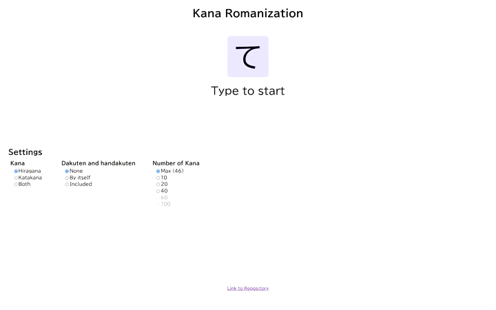

# Kana Romanization

This project is a simple site to practice reading individual Japanese kana,
including hiragana, katakana, and kana with diacritics (dakuten ゛ and
handakuten ゜). Hepburn, Kunrei-shiki, and Nihon-shoki systems of romanization
are all acceptable when answering.

The site is functional on desktop only.

## Running Locally

Everything is done using standard HTML, CSS, and Javascript, which means that
it is possible to use the site without an internet connection.

To do so, head to the releases page and download the source code zip. After
extracting everything into a file, simply open index.html with any web browser.
